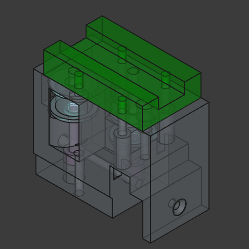
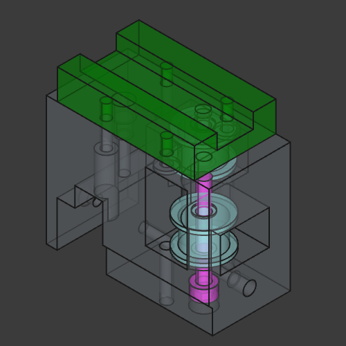

# Creality `K1` XY Rails Mod

## Description


This mod fixes `K1` issues namely excessive ringing/echo, unstable print quality, frequent maintenance, also it makes printer quiet.

It should be compatible with regular `K1` (tested), `K1C` and `K1 SE` (not tested, likely heat sink needs to be replaced with heatsink from regular `K1`).

 - **This mod does not change print area**
 - **You must use camera mount from this mod (8mm lower than original)**
 - **You must remove stock motor pulleys (or use non-stock stepper motors)**

#### Belts, pulleys, motors

This mode uses `POWGE` 7.7 mm belt and corresponding idler pulleys. You can use 6 mm belt with stock idlers if you add washers to compensate height differences (`POWGE` idlers have 10.4 mm height), also you can use `F604ZZ` flanged bearings (not tested).

You have to remove stock motor pulleys. You can use a bearing puller to do that (some people use printed pullers e.g. [pulley puller](https://www.printables.com/model/515503-pulley-puller)). If pulleys sit too tight you can use dremel and make cuts to relax pulleys. you have to be careful to avoid damage to motor shafts

I used 20T motor pulleys for 15 mm belt (`rotation_distance` needs to be adjusted to `40` and `driver_SGTHRS` must be tuned `printer.cfg`).

You can install non-stock motors e.g. `Leadshine 42cm06 1.8` or `LDO-42STH48-1684MAC 0.9` (requires `full_steps_per_rotation: 400`, loud, limited acceleration but potentially better print quality).

This mod uses double diaphragm couplers and `MF95ZZ` bearings.

#### Linear rails

This mod uses two `MGN12` rails with `MGN12H` carriages for Y and one `MGN9` rail with `MGN9H` carriage for X axis.

X rail has max length of 331 mm, 320 mm between far left and far right holes. X axis requires 15x15x2 mm aluminium tube (the same length as rail). It is important to use quality rails for X axis (with minimal backlash).

Y rails have max length of 314 mm (safe 310 mm), 300 mm between far left and far right holes. 

#### Materials

Recommended printing materials are PA-GF, PA-CF, ABS-GF, ABS-CF or anything else that is rigid and can sustain high temperatures. I don't recommend printing toolhead with pure ABS.

## License

All work in this repository falls under the Attribution-NonCommercial-ShareAlike 4.0 International (CC BY-NC-SA 4.0).

https://creativecommons.org/licenses/by-nc-sa/4.0/

### Notes

Partially this work is based on [creality-k1-max-xy-rails-mod](https://github.com/kemsky/creality-k1-max-xy-rails-mod) and uses some CAD files made by [Henlor](https://www.printables.com/@Henlor).

## Published

https://www.printables.com/model/1109686-creality-k1-xy-linear-rails-mod

## Photos

<details>
    <summary>Photo 1</summary>
    
</details>

<details>
    <summary>Photo 2</summary>
    
</details>

<details>
    <summary>Photo 3</summary>
    
</details>

<details>
    <summary>Photo 4</summary>
    
</details>

<details>
    <summary>Photo 5</summary>
    
</details>

## BOM, Assembly, etc.

### Front idler left

! `Flat Thin Wafer Head Screw` - M3 screws with flat head that has 1 mm thickness. 
You can find those on AliExpress, manufacturer NINDEJIN, search for "Ultra Low Profile Head Screw".


### Camera

<details>
    <summary>Preview</summary>
    
</details>

[k1_camera.stl](/stl/k1_camera.stl)

<details>
    <summary>Preview</summary>
    
</details>

[front_idler_left.stl](/stl/k1_front_idler_left.stl)

| Item                            | Type      | Count |
|---------------------------------|-----------|-------|
| DIN 912 Flat Head Cap Screw     | M4 30 mm  | 1     |
| DIN 7991 Flat Head Cap Screw    | M3 6 mm   | 4     |
| DIN 912 Socket Head Cap Screw   | M3 16 mm  | 1     |
| POWGE GT2 No Teeth Idler Pulley | 7.7 mm    | 1     |
| Heat insert                     | M3 5x5 mm | 5     |

### Front idler right

<details>
    <summary>Preview</summary>
    
</details>

[front_idler_right.stl](/stl/k1_front_idler_right.stl)

| Item                            | Type      | Count |
|---------------------------------|-----------|-------|
| DIN 912  Flat Head Cap Screw    | M4 30 mm  | 1     |
| DIN 7991 Flat Head Cap Screw    | M3 6 mm   | 4     |
| DIN 912 Socket Head Cap Screw   | M3 16 mm  | 1     |
| POWGE GT2 No Teeth Idler Pulley | 7.7 mm    | 1     |
| Heat insert                     | M3 5x5 mm | 5     |

### Joint left

<details>
    <summary>Preview</summary>
    
</details>

[k1_joint_left.stl](/stl/k1_joint_left.stl)

| Item                            | Type        | Count |
|---------------------------------|-------------|-------|
| DIN 912  Flat Head Cap Screw    | M4 30 mm    | 2     |
| DIN 7991 Flat Head Cap Screw    | M3 25 mm    | 1     |
| Flat Thin Wafer Head Screw      | M3 6 mm     | 1     |
| DIN 912 Socket Head Cap Screw   | M3 12 mm    | 3     |
| DIN 912 Socket Head Cap Screw   | M3 25 mm    | 1     |
| POWGE GT2 No Teeth Idler Pulley | 7.7 mm      | 2     |
| Heat insert                     | M3 4.5x5 mm | 1     |
| Heat insert                     | M3 5x7 mm   | 1     |

### Joint right

<details>
    <summary>Preview</summary>
    
</details>

[k1_joint_right.stl](/stl/k1_joint_right.stl)

| Item                            | Type        | Count |
|---------------------------------|-------------|-------|
| DIN 912  Flat Head Cap Screw    | M4 30 mm    | 2     |
| DIN 7991 Flat Head Cap Screw    | M3 25 mm    | 1     |
| Flat Thin Wafer Head Screw      | M3 6 mm     | 2     |
| DIN 912 Socket Head Cap Screw   | M3 12 mm    | 2     |
| DIN 912 Socket Head Cap Screw   | M3 25 mm    | 1     |
| POWGE GT2 No Teeth Idler Pulley | 7.7 mm      | 2     |
| Heat insert                     | M3 4.5x5 mm | 1     |
| Heat insert                     | M3 5x7 mm   | 1     |

### Tensioner left

<details>
    <summary>Preview</summary>
    
</details>

[k1_tensioner_left.stl](/stl/k1_tensioner_left.stl)

| Item                            | Type        | Count |
|---------------------------------|-------------|-------|
| DIN 912 Socket Head Cap Screw   | M3 45 mm    | 1     |
| DIN 912 Socket Head Cap Screw   | M3 16 mm    | 2     |
| DIN 912 Socket Head Cap Screw   | M4 20 mm    | 1     |
| POWGE GT2 No Teeth Idler Pulley | 7.7 mm      | 1     |
| Heat insert                     | M3 3x4.5 mm | 2     |

### Tensioner right

<details>
    <summary>Preview</summary>
    
</details>

[k1_tensioner_right.stl](/stl/k1_tensioner_right.stl)

| Item                            | Type        | Count |
|---------------------------------|-------------|-------|
| DIN 912 Socket Head Cap Screw   | M3 45 mm    | 1     |
| DIN 912 Socket Head Cap Screw   | M3 16 mm    | 2     |
| DIN 912 Socket Head Cap Screw   | M4 20 mm    | 1     |
| POWGE GT2 No Teeth Idler Pulley | 7.7 mm      | 1     |
| Heat insert                     | M3 3x4.5 mm | 2     |

### Motor mount left (stock motors)

<details>
    <summary>Preview</summary>
    
</details>

[k1_motor_mount_stock_left.stl](/stl/k1_motor_mount_stock_left.stl)

| Item                            | Type      | Count |
|---------------------------------|-----------|-------|
| DIN 7991 Flat Head Cap Screw    | M3 6 mm   | 4     |
| DIN 912 Socket Head Cap Screw   | M3 6 mm   | 3     |
| DIN 912 Socket Head Cap Screw   | M3 16 mm  | 1     |
| Flat Thin Wafer Head Screw      | M3 6 mm   | 2     |
| MF95ZZ Bearing                  |           | 2     |
| Double Diaphragm Coupler        | 20x30 5x5 | 1     |
| Shaft                           | 5x57 mm   | 1     |
| Motor Pulley for 15mm belt      | 20T 5 mm  | 1     |
| POWGE GT2 No Teeth Idler Pulley | 7.7 mm    | 2     |
| Heat insert                     | M3 5x5 mm | 6     |


### Motor mount right (stock motors)

<details>
    <summary>Preview</summary>
    
</details>

[k1_motor_mount_stock_right.stl](/stl/k1_motor_mount_stock_right.stl)

| Item                            | Type      | Count |
|---------------------------------|-----------|-------|
| DIN 7991 Flat Head Cap Screw    | M3 6 mm   | 4     |
| DIN 912 Socket Head Cap Screw   | M3 6 mm   | 3     |
| DIN 912 Socket Head Cap Screw   | M3 16 mm  | 1     |
| Flat Thin Wafer Head Screw      | M3 6 mm   | 2     |
| MF95ZZ Bearing                  |           | 2     |
| Double Diaphragm Coupler        | 20x30 5x5 | 1     |
| Shaft                           | 5x57 mm   | 1     |
| Motor Pulley for 15mm belt      | 20T 5 mm  | 1     |
| POWGE GT2 No Teeth Idler Pulley | 7.7 mm    | 2     |
| Heat insert                     | M3 5x5 mm | 6     |


**! This is work in progress**

## Automation

`export.sh`/`export.cmd` scripts export all necessary objects to STl and STEP and optionally capture model screenshots.

```bash
# without updating screenshots:
./export
# export STL, STEP and generate model screenshots:
./export screenshots
```