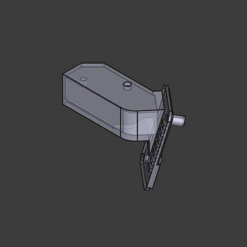
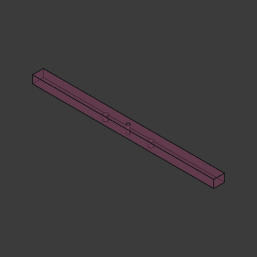
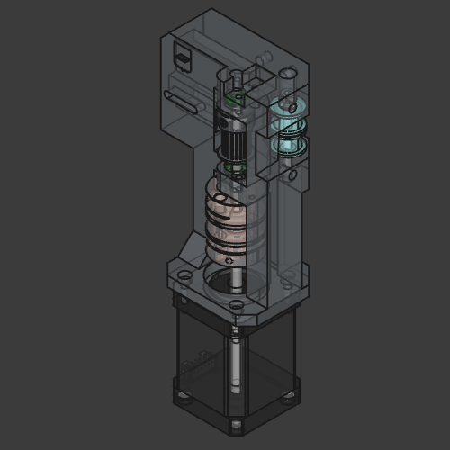
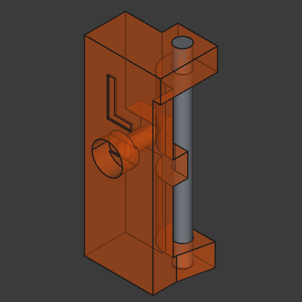
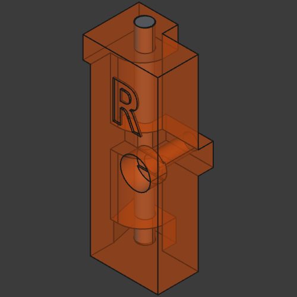
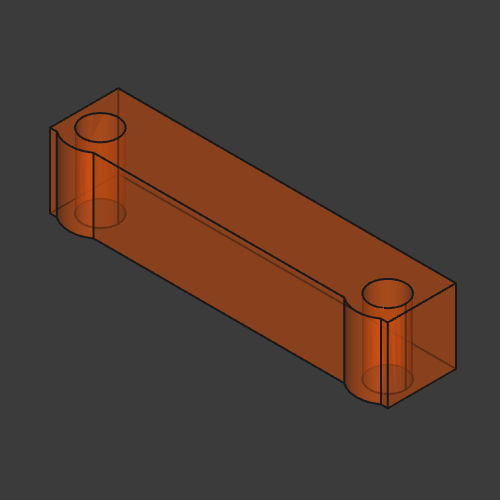
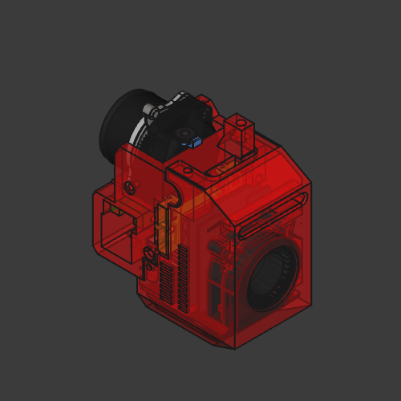
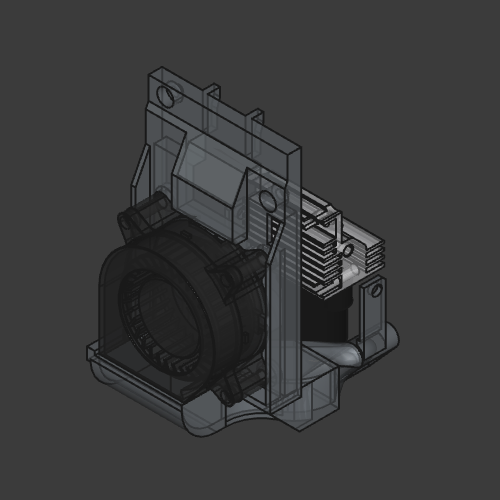

# Creality `K1` XY Rails Mod

## Description


This mod fixes `K1` issues namely excessive ringing/echo, unstable print quality, frequent maintenance, also it makes printer quiet.

It should be compatible with regular `K1` (tested), `K1C` and `K1 SE` (not tested, likely heat sink needs to be replaced with heatsink from regular `K1`).

- **This mod does not change print area**
- **You must use camera mount from this mod (8mm lower than original)**
- **You must remove stock motor pulleys (or use non-stock stepper motors)**

### Belts, pulleys, motors

This mode uses `POWGE` 7.7 mm belt and corresponding idler pulleys. You can use 6 mm belt and stock idlers if you add washers to compensate height differences (`POWGE` idlers have 10.4 mm height). Also, you can use `F604ZZ` flanged bearings (4x12x4) and 2mm washers instead of `POWGE` pulleys.

You have to remove stock motor pulleys. You can use a bearing puller to do that (some people use printed pullers e.g. [pulley puller](https://www.printables.com/model/515503-pulley-puller)). If pulleys sit too tight you can use dremel and make cuts to relax pulleys. you have to be careful to avoid damage to motor shafts

I used 20T motor pulleys for 15 mm belt (`rotation_distance` needs to be adjusted to `40` and `driver_SGTHRS` must be tuned `printer.cfg`).

You can install non-stock motors e.g. `Leadshine 42cm06 1.8` (low VFA, need custom wiring, expensive) or `LDO-42STH48-1684MAC 0.9` (requires `full_steps_per_rotation: 400`, loud, limited acceleration, low VFA).

This mod uses double diaphragm couplers and `MF95ZZ` bearings.

#### Belts tuning

Preferred way is to use Spectroid android app (or any other program that can show sound frequency).

Move toolhead to the middle, move X axis to have 150mm between motor mounts and XY joints.

Pluck the shortest belt on each side, displayed frequency should be the same. Target frequency is 120-130Hz, if you go higher than 130Hz you risk to damage belts.

#### Linear rails

This mod uses two `MGN12` rails with `MGN12H` carriages for Y and one `MGN9` rail with `MGN9H` carriage for X axis.

X rail has max length of 331 mm, 300 mm between far left and far right holes. X axis requires 15x15x2 mm aluminium tube (the same length as rail). It is important to use quality rails for X axis (with minimal backlash).

Y rails have max length of 314 mm (safe 310 mm), 300 mm between far left and far right holes.

#### Materials

Recommended printing materials are PA-GF, PA-CF, ABS-GF, ABS-CF or anything else that is rigid and can sustain high temperatures. I don't recommend printing toolhead with pure ABS. I'd recommend PA-GF or PA-CF, as screw joints tend to become loose in ABS.

Wall loops, top/bottom layers should be at least 5, for motor mounts I'd recommend 6-7.

<details>
    <summary>Printing orientation</summary>
    
</details>

#### Options for maximum performance

- Use light extruder - [KKm extruder](https://www.printables.com/model/906070-artis3d-kkm-extruder-remix) (probably I'll upload my own remix)
- Use light extruder motor - LDO 36STH17-0354AHG or 36STH20-1004AHG
- Use light mgn9 rails - hollow/milled rails from FYSETC (they have 6mm height instead of 6.5mm, you have to print spacer)

## License

All work in this repository falls under the Attribution-NonCommercial-ShareAlike 4.0 International (CC BY-NC-SA 4.0).

<https://creativecommons.org/licenses/by-nc-sa/4.0/>

### Notes

Partially this work is based on [creality-k1-max-xy-rails-mod](https://github.com/kemsky/creality-k1-max-xy-rails-mod) and uses some CAD files made by [Henlor](https://www.printables.com/@Henlor).

## Published

<https://www.printables.com/model/1109686-creality-k1-xy-linear-rails-mod>

<https://www.thingiverse.com/thing:6893994>

<https://makerworld.com/en/models/931135>

## Photos

<details>
    <summary>Photo 1</summary>
    
</details>

<details>
    <summary>Photo 2</summary>
    
</details>

<details>
    <summary>Photo 3</summary>
    
</details>

<details>
    <summary>Photo 4</summary>
    
</details>

<details>
    <summary>Photo 5</summary>
    
</details>

## BOM, Assembly

! `Flat Thin Wafer Head Screw` - M3 screws with flat head that has 1 mm thickness.
You can find those on AliExpress, manufacturer NINDEJIN, search for "Ultra Low Profile Head Screw".

### Camera

<details>
    <summary>Preview</summary>
    
</details>
<br>

[k1_camera.stl](/stl/k1_camera.stl)

### Front idler left

<details>
    <summary>Preview</summary>
    
</details>
<br>

[front_idler_left.stl](/stl/k1_front_idler_left.stl)

| Item                            | Type      | Count |
|---------------------------------|-----------|-------|
| DIN 912 Socket Head Cap Screw   | M4 30 mm  | 1     |
| DIN 7991 Flat Head Cap Screw    | M3 6 mm   | 4     |
| DIN 912 Socket Head Cap Screw   | M3 16 mm  | 1     |
| POWGE GT2 No Teeth Idler Pulley | 7.7 mm    | 1     |
| Heat insert                     | M3 5x5 mm | 5     |

### Front idler right

<details>
    <summary>Preview</summary>
    
</details>
<br>

[front_idler_right.stl](/stl/k1_front_idler_right.stl)

| Item                            | Type      | Count |
|---------------------------------|-----------|-------|
| DIN 912 Socket Head Cap Screw   | M4 30 mm  | 1     |
| DIN 7991 Flat Head Cap Screw    | M3 6 mm   | 4     |
| DIN 912 Socket Head Cap Screw   | M3 16 mm  | 1     |
| POWGE GT2 No Teeth Idler Pulley | 7.7 mm    | 1     |
| Heat insert                     | M3 5x5 mm | 5     |

### Joint left

<details>
    <summary>Preview</summary>
    
</details>
<br>

[k1_joint_left.stl](/stl/k1_joint_left.stl)

| Item                            | Type        | Count |
|---------------------------------|-------------|-------|
| DIN 912 Socket Head Cap Screw   | M4 30 mm    | 2     |
| DIN 7991 Flat Head Cap Screw    | M3 52 mm    | 1     |
| Flat Thin Wafer Head Screw      | M3 6 mm     | 1     |
| DIN 912 Socket Head Cap Screw   | M3 12 mm    | 3     |
| DIN 912 Socket Head Cap Screw   | M3 25 mm    | 1     |
| POWGE GT2 No Teeth Idler Pulley | 7.7 mm      | 2     |
| MGN12H block                    |             | 2     |
| Heat insert                     | M3 4.5x5 mm | 1     |
| Heat insert                     | M3 5x7 mm   | 1     |

### Joint right

<details>
    <summary>Preview</summary>
    
</details>
<br>

[k1_joint_right.stl](/stl/k1_joint_right.stl)

| Item                            | Type        | Count |
|---------------------------------|-------------|-------|
| DIN 912 Socket Head Cap Screw   | M4 30 mm    | 2     |
| DIN 7991 Flat Head Cap Screw    | M3 52 mm    | 1     |
| Flat Thin Wafer Head Screw      | M3 6 mm     | 2     |
| DIN 912 Socket Head Cap Screw   | M3 12 mm    | 2     |
| DIN 912 Socket Head Cap Screw   | M3 25 mm    | 1     |
| POWGE GT2 No Teeth Idler Pulley | 7.7 mm      | 2     |
| MGN12H block                    |             | 2     |
| Heat insert                     | M3 4.5x5 mm | 1     |
| Heat insert                     | M3 5x7 mm   | 1     |

### Y rail mounts

<details>
    <summary>Preview</summary>
    
</details>
<br>

[k1_rail_mount.stl](/stl/k1_rail_mount.stl) x2

| Item                            | Type      | Count |
|---------------------------------|-----------|-------|
| DIN 912 Socket Head Cap Screw   | M3 16 mm  | 1     |
| DIN 912 Socket Head Cap Screw   | M3 8 mm   | 2     |
| Heat insert                     | M3 5x5 mm | 2     |

Mounting Y rails to the top frame is important if you want less vibrations.
Default mount option is printed mount. You'll have to drill and tap M3 thread in the top frame.

Instead of printed mount you can buy metal plate or a set of plates to get ~8.5 mm thickness.

### Y axis

See [cad_rail_mgn12.FCStd](/src/cad_rail_mgn12.FCStd) for exact configuration and dimensions.

| Item                          | Type   | Count |
|-------------------------------|--------|-------|
| MGN12 liner rail              | 310 mm | 2     |

### X axis

See [cad_x_axis.FCStd](/src/cad_x_axis.FCStd) for exact configuration and dimensions.

First, make two holes on the left and on the right, tap M3 threads, mount MGN9 rail, align it carefully and tighten screws. Use rail as drilling template, first make mark using 4 mm drill bit, then drill remaining holes using 2.5 mm drill bit, then tap M3 threads.

| Item                          | Type           | Count |
|-------------------------------|----------------|-------|
| Aluminium square pipe         | 15x15x2 331 mm | 1     |
| DIN 912 Socket Head Cap Screw | M3 6 mm        | 7-14  |
| MGN9 liner rail               | 331 mm         | 1     |

### Tensioner left

<details>
    <summary>Preview</summary>
    
</details>
<br>

[k1_tensioner_left.stl](/stl/k1_tensioner_left.stl)

| Item                            | Type        | Count |
|---------------------------------|-------------|-------|
| DIN 912 Socket Head Cap Screw   | M3 45 mm    | 1     |
| DIN 912 Socket Head Cap Screw   | M3 16 mm    | 2     |
| DIN 912 Socket Head Cap Screw   | M4 20 mm    | 1     |
| Washer/Gasket                   | M3          | 2     |
| POWGE GT2 No Teeth Idler Pulley | 7.7 mm      | 1     |
| Heat insert                     | M3 3x4.5 mm | 2     |

### Tensioner right

<details>
    <summary>Preview</summary>
    
</details>
<br>

[k1_tensioner_right.stl](/stl/k1_tensioner_right.stl)

| Item                            | Type        | Count |
|---------------------------------|-------------|-------|
| DIN 912 Socket Head Cap Screw   | M3 45 mm    | 1     |
| DIN 912 Socket Head Cap Screw   | M3 16 mm    | 2     |
| DIN 912 Socket Head Cap Screw   | M4 20 mm    | 1     |
| Washer/Gasket                   | M3          | 2     |
| POWGE GT2 No Teeth Idler Pulley | 7.7 mm      | 1     |
| Heat insert                     | M3 3x4.5 mm | 2     |

### Motor mount left

<details>
    <summary>Preview</summary>
    
</details>
<br>

- For stock motors - [k1_motor_mount_stock_left.stl](/stl/k1_motor_mount_stock_left.stl)
- For non-stock motors - [k1_motor_mount_left.stl](/stl/k1_motor_mount_left.stl)

| Item                            | Type      | Count |
|---------------------------------|-----------|-------|
| DIN 7991 Flat Head Cap Screw    | M3 6 mm   | 4     |
| DIN 912 Socket Head Cap Screw   | M3 6 mm   | 3     |
| DIN 912 Socket Head Cap Screw   | M3 16 mm  | 1     |
| Flat Thin Wafer Head Screw      | M3 6 mm   | 2     |
| MF95ZZ Bearing                  |           | 2     |
| Double Diaphragm Coupler        | 20x30 5x5 | 1     |
| Shaft                           | 5x57 mm   | 1     |
| Motor Pulley for 15mm belt      | 20T 5 mm  | 1     |
| POWGE GT2 No Teeth Idler Pulley | 7.7 mm    | 2     |
| Heat insert                     | M3 5x5 mm | 6     |

You'll need 1 M3x35 screw from stock gantry motor mounts.

### Motor mount right

<details>
    <summary>Preview</summary>
    
</details>
<br>

- For stock motors - [k1_motor_mount_stock_right.stl](/stl/k1_motor_mount_stock_right.stl)
- For non-stock motors - [k1_motor_mount_right.stl](/stl/k1_motor_mount_right.stl)

| Item                            | Type      | Count |
|---------------------------------|-----------|-------|
| DIN 7991 Flat Head Cap Screw    | M3 6 mm   | 4     |
| DIN 912 Socket Head Cap Screw   | M3 6 mm   | 3     |
| DIN 912 Socket Head Cap Screw   | M3 16 mm  | 1     |
| Flat Thin Wafer Head Screw      | M3 6 mm   | 2     |
| MF95ZZ Bearing                  |           | 2     |
| Double Diaphragm Coupler        | 20x30 5x5 | 1     |
| Shaft                           | 5x57 mm   | 1     |
| Motor Pulley for 15mm belt      | 20T 5 mm  | 1     |
| POWGE GT2 No Teeth Idler Pulley | 7.7 mm    | 2     |
| Heat insert                     | M3 5x5 mm | 6     |

You'll need 1 M3x35 screw from stock gantry motor mounts.

### Toolhead clamp left

<details>
    <summary>Preview</summary>
    
</details>
<br>

[k1_toolhead_left_clamp.stl](/stl/k1_toolhead_left_clamp.stl)

| Item                            | Type        | Count |
|---------------------------------|-------------|-------|
| DIN 912 Socket Head Cap Screw   | M2 10 mm    | 1     |
| Shaft                           | 2x25 mm     | 1     |

### Toolhead clamp right

<details>
    <summary>Preview</summary>
    
</details>
<br>

[k1_toolhead_right_clamp.stl](/stl/k1_toolhead_right_clamp.stl)

| Item                            | Type        | Count |
|---------------------------------|-------------|-------|
| DIN 912 Socket Head Cap Screw   | M2 10 mm    | 1     |
| Shaft                           | 2x25 mm     | 1     |

### Toolhead fan spacer

<details>
    <summary>Preview</summary>
    
</details>
<br>

Regular hotend - [k1_toolhead_spacer.stl](/stl/k1_toolhead_spacer.stl)

Unicorn hotend - [k1_toolhead_spacer_unicorn.stl](/stl/k1_toolhead_spacer_unicorn.stl)

### Toolhead

<details>
    <summary>Preview</summary>
    
</details>
<br>

[k1_toolhead.stl](/stl/k1_toolhead.stl)

| Item                            | Type        | Count |
|---------------------------------|-------------|-------|
| Flat Thin Wafer Head Screw      | M3 6 mm     | 4     |
| Flat Thin Wafer Head Screw      | M3 8 mm     | 3     |
| DIN 912 Socket Head Cap Screw   | M2 12 mm    | 1     |
| MGN9H block                     |             | 1     |
| Heat insert                     | M3 4.5x3 mm | 6     |
| Heat insert                     | M3 5x7 mm   | 1     |
| Heat insert                     | M3 5x4 mm   | 4     |
| Heat insert                     | M2 3.5x3 mm | 4     |

#### Toolhead Microprobe

| Item                            | Type            | Count |
|---------------------------------|-----------------|-------|
| Heat insert                     | M2.5 3.5x4 mm   | 2     |

You can install `BIQU MicroProbe` sensor which is much better than original load cell probe.

[ **!** ] Pins on toolhead board ("touch" connector) do not match microprobe pins, you can not use premade JST 1.25 5pins cable, you'll have to make your own.

<details>
    <summary>Pins</summary>
    
    
</details>
<br>

```pre
- touch GND            -> microprobe GND    (black)
- touch 5v             -> microprobe 5v     (red)
- touch nozzle_mcu:PA8 -> microprobe servo  (yellow)
- touch GND            -> microprobe GND    (black)
- touch nozzle_mcu:PA9 -> microprobe probe  (white)
```

1. Remove all `prtouch` sections from `printer.cfg`
2. Edit `/usr/share/klipper/klippy/extras/custom_macro.py` and comment all prtouch usages
3. Remove `/usr/share/klipper/klippy/extras/custom_macro.pyc` and reboot
4. Add the following to `printer.cfg`:

    ```cfg
    [gcode_macro _PROBE_DOWN]
    gcode:
        SET_PIN PIN=probe_enable VALUE=1

    [gcode_macro _PROBE_UP]
    gcode:
        SET_PIN PIN=probe_enable VALUE=0

    [output_pin probe_enable]
    pin: nozzle_mcu:PA8
    value: 0

    [probe]
    pin: ^!nozzle_mcu:PA9
    deactivate_on_each_sample: False
    x_offset: 0
    y_offset: 20
    z_offset: 0  # do PROBE_CALIBRATE
    samples: 2
    samples_tolerance: 0.05
    samples_tolerance_retries: 3
    activate_gcode:
        _PROBE_DOWN
        G4 P500
    deactivate_gcode:
        _PROBE_UP
    ```

5. Modify `[stepper_z]` section in `printer.cfg`, set `endstop_pin` to `probe:z_virtual_endstop`
6. Use `PROBE_CALIBRATE` macros to determine Z-Offset and save it.
7. Sometimes you can get error `Communication Timeout during homing z`. Use `vi /usr/share/klipper/klippy/mcu.py` and increase `TRSYNC_TIMEOUT` from 0.025 up to 0.05. Remove file `/usr/share/klipper/klippy/mcu.pyc`, reboot.

Depending on your hotend you may need a spacer.

<details>
    <summary>Microprobe spacer</summary>
    
</details>
<br>

[k1_toolhead_microprobe_spacer.stl](/stl/k1_toolhead_microprobe_spacer.stl)

## Bonus Models

### Toolhead cover

<details>
    <summary>Preview</summary>
    
</details>
<br>

[k1_toolhead_cover.stl](/stl/k1_toolhead_cover.stl)

### Compact toolhead cover

<details>
    <summary>Preview</summary>
    
</details>
<br>

[k1_toolhead_cover_experimental.stl](/stl/k1_toolhead_cover_experimental.stl)

### Cable covers

<details>
    <summary>Preview</summary>
    
</details>
<br>

Horizontal - [k1_cable_cover_horizontal.stl](/stl/k1_cable_cover_horizontal.stl)

Vertical top - [k1_cable_cover_vertical_top.stl](/stl/k1_cable_cover_vertical_top.stl)

Vertical bottom - [k1_cable_cover_vertical_bottom.stl](/stl/k1_cable_cover_vertical_bottom.stl)

### Z-Carriage for T8 Oldham Coupler

<details>
    <summary>Preview</summary>
    
</details>
<br>

[k1_z_carriage_oldham.stl](/stl/k1_z_carriage_oldham.stl)

### Side fan duct

<details>
    <summary>Preview</summary>
    
</details>
<br>

[k1_side_fan_duct.stl](/stl/k1_side_fan_duct.stl)

### Cutter block

Requires 2x25mm DIN 912 M3 screws.

<details>
    <summary>Preview</summary>
    
</details>
<br>

[k1_cutter_block.stl](/stl/k1_cutter_block.stl)

## Automation

`export.sh`/`export.cmd` scripts export all necessary objects to STl and STEP and optionally capture model screenshots.

```bash
# without updating screenshots:
./export.sh
# export STL, STEP and generate model screenshots:
./export.sh screenshots
```
